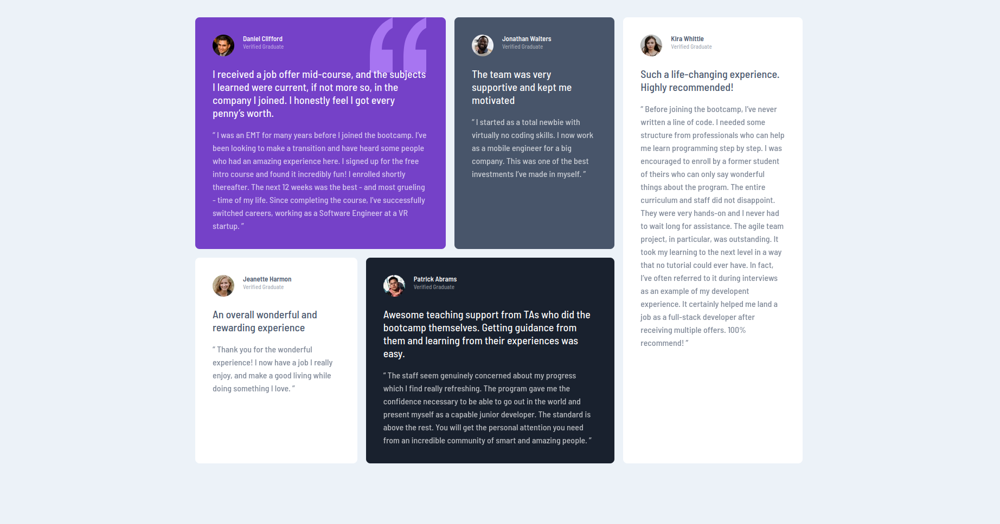

# Frontend Mentor - Testimonials grid section solution

This is a solution to the [Testimonials grid section challenge on Frontend Mentor](https://www.frontendmentor.io/challenges/testimonials-grid-section-Nnw6J7Un7). Frontend Mentor challenges help you improve your coding skills by building realistic projects. 

## Table of contents

- [Overview](#overview)
  - [The challenge](#the-challenge)
  - [Screenshot](#screenshot)
  - [Links](#links)
- [My process](#my-process)
  - [Built with](#built-with)
  - [What I learned](#what-i-learned)
  - [Continued development](#continued-development)
- [Author](#author)
- [Acknowledgments](#acknowledgments)

**Note: Delete this note and update the table of contents based on what sections you keep.**

## Overview

### The challenge

The challenge was to create the design using CSS Grid.

### Screenshot

### Links

- Solution URL: [Add solution URL here](https://github.com/UrbanskiDev/Testimonials-grid-section)
- Live Site URL: [Add live site URL here](https://testimonials-grid-section-one-iota.vercel.app/)

## My process

### Built with

- Semantic HTML5 markup
- CSS custom properties
- CSS Grid

### What I learned

I learned to appreciate CSS Grid. I'll start to use it more often than Flexbox

### Continued development

I will continue to practice CSS Grid, to make a better use of it, and use both Flexbox and Grid instead of only using Flexbox.

## Author

- Website - [Anthony](https://www.your-site.com)
- Frontend Mentor - [@UrbanskiDev](https://www.frontendmentor.io/profile/UrbanskiDev)

## Acknowledgments

I give a special thanks to Kevin Powell, which helped me to understand better how to use grid easily.
